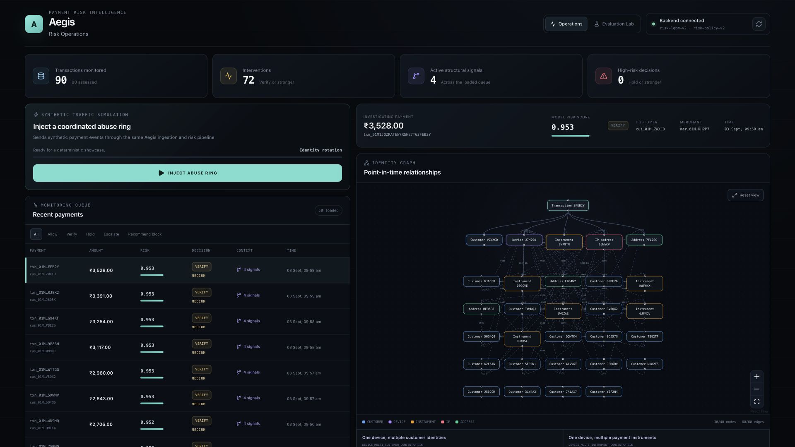
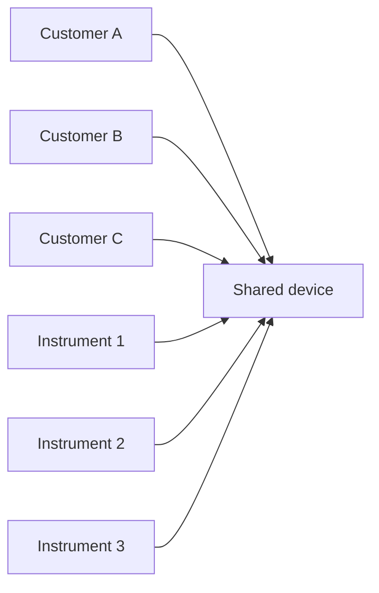
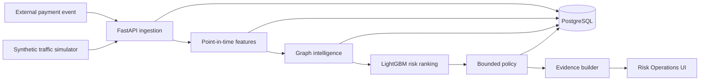
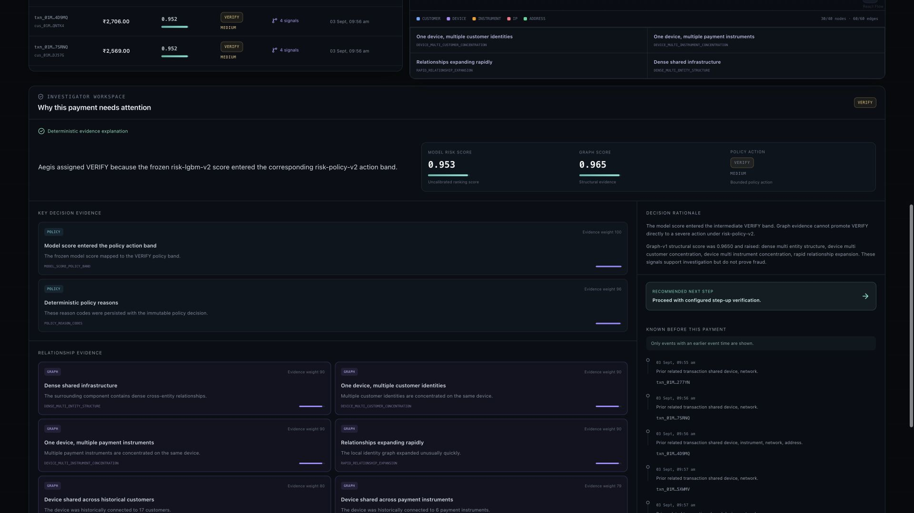
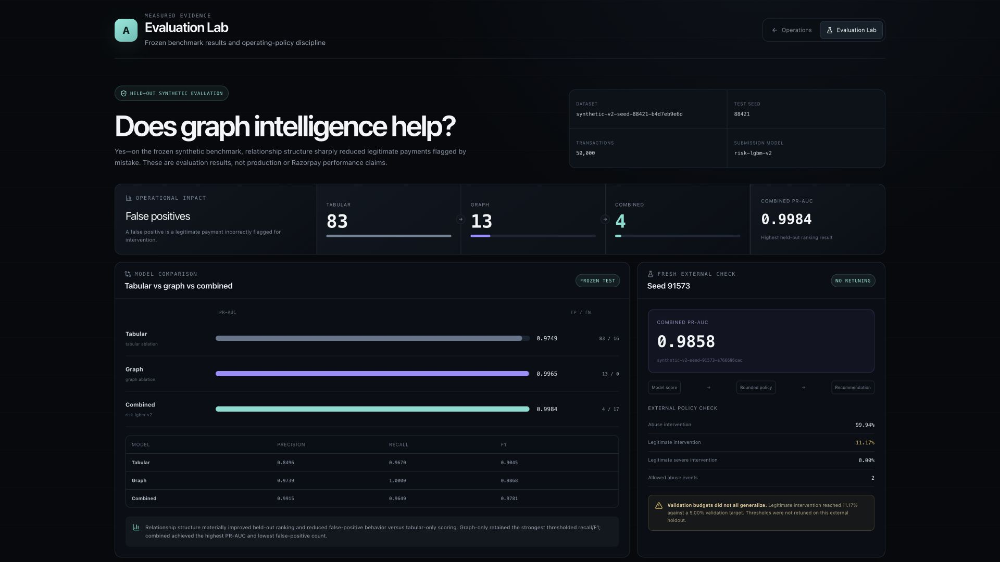

# Aegis

A graph-assisted payment-risk system that detects coordinated abuse across seemingly unrelated
accounts and explains the evidence behind every intervention.

**Individual payments can look legitimate.<br>
Aegis detects the network behind them.**

Traditional transaction-level scoring sees a payment in isolation. Aegis also models
relationships between customers, devices, payment instruments, IPs, and addresses to surface
coordinated infrastructure reuse.

Aegis is a working end-to-end prototype: durable FastAPI ingestion, PostgreSQL persistence,
point-in-time features and graph intelligence, a frozen LightGBM risk ranker, deterministic
bounded policy, evidence-first investigation, and a Next.js risk-operations interface. Its
reported evaluation uses frozen, held-out **synthetic** data and is not a production-performance
claim.

`52 behavioral features` · `25 graph metrics` · `77 model inputs` · `strict historical cutoff`



## Why transaction-only risk can miss the pattern

Each payment below can look plausible on its own. The shared infrastructure is suspicious only
when the relationships are considered together.



Aegis targets coordinated payment-abuse rings rather than a single transaction pattern. The
synthetic evaluation includes `CARD_TESTING`, `ACCOUNT_FARM`, `IDENTITY_ROTATION`, and
`COLLUSIVE_RING`, with ground truth separated as `LEGITIMATE` versus `COORDINATED_ABUSE`.
Ground-truth fields remain outside runtime scoring, policy, API, and investigation contracts. See
the [threat model](docs/THREAT_MODEL.md) for the defensive boundary.

## What Aegis does

1. **Receive a payment event.** FastAPI validates a tokenized `RawPaymentEvent` contract; no PAN
   or CVV is required.
2. **Persist the source event.** The original payload is durably recorded before normalized work,
   preserving receipt and processing status for audit and recovery.
3. **Compute point-in-time behavior.** `features-v1` derives 52 velocity, history, novelty, and
   amount-context features using a strict `[history, current)` cutoff.
4. **Reconstruct relationship evidence.** `graph-v1` builds a typed historical graph and derives
   25 structural metrics without reading future edge state.
5. **Rank behavioral risk.** `risk-lgbm-v2` consumes the 77 registered inputs and emits an
   uncalibrated ranking score—not a fraud probability.
6. **Apply bounded policy.** `risk-policy-v2` maps the score to an allowed intervention and permits
   graph evidence to corroborate only an already-existing `HOLD`.
7. **Build an investigation.** A truth-free EvidenceBundle explains the persisted decision,
   structural evidence, limitations, and strictly prior history for an operator.

## Architecture



The simulator is another event source, not a privileged scoring path. External and synthetic
payments use the same ingestion, feature, graph, model, policy, persistence, and investigation
services.

PostgreSQL is the system of record. Raw events and audit records are append-only by application
policy; normalized writes are transactional; failed normalization retains the raw event without
partial normalized state. Alembic owns schema evolution, while versioned snapshots allow future
feature, graph, model, and policy versions to coexist.

## Graph intelligence

The graph engine asks one operational question:

> Does this payment sit inside a coordinated relationship pattern?

It reconstructs typed `CUSTOMER`, `DEVICE`, `PAYMENT_INSTRUMENT`, `IP`, and `ADDRESS` nodes from
historical transactions. Merchants are deliberately excluded from graph connectivity so a popular
merchant cannot join unrelated customers into one component.

The 25 point-in-time metrics measure degree, component composition and density, new relationships,
component bridging, two-hop reach, and rapid expansion. The operator sees human-readable signals
such as:

- One device shared across multiple customers (`DEVICE_MULTI_CUSTOMER_CONCENTRATION`)
- One device shared across multiple instruments (`DEVICE_MULTI_INSTRUMENT_CONCENTRATION`)
- Relationships expanding rapidly (`RAPID_RELATIONSHIP_EXPANSION`)
- Dense shared infrastructure (`DENSE_MULTI_ENTITY_STRUCTURE`)

Structural signals are evidence, not proof of abuse. Cluster identifiers are Aegis-generated
investigation handles, never synthetic truth-ring IDs.

## Point-in-time safety

For a payment at time **T**, Aegis uses only information with `event_time < T`:

```text
past events ✓  ──────────>  current payment T  ──────────>  future events ✕
                  usable                         unavailable
```

The online PostgreSQL provider enforces the cutoff in queries. Offline generation computes each
timestamp batch before observing it, so equal-time transactions cannot see one another. Historical
features and investigation evidence avoid mutable entity-profile fields that later ingestion could
rewrite. Future activity therefore cannot change an earlier decision snapshot or historical
evidence, apart from the report's new `generated_at` timestamp.

This boundary prevents look-ahead leakage: training and runtime decisions cannot benefit from
information that would not have existed when the payment arrived.

## Risk score is not the decision

LightGBM produces an **uncalibrated risk ranking score**. The graph engine separately describes
relationship structure. A deterministic, versioned policy decides the permitted intervention:

| Action | Meaning |
|---|---|
| `ALLOW` | Permit without additional intervention |
| `VERIFY` | Request bounded step-up verification |
| `HOLD` | Hold for additional review |
| `ESCALATE` | Escalate an existing HOLD with corroborating graph evidence |
| `RECOMMEND_BLOCK` | Recommend human review of an existing HOLD with stronger corroboration |

Graph evidence cannot independently promote an `ALLOW` or `VERIFY` into a severe action.
`RECOMMEND_BLOCK` is a recommendation to a human reviewer; Aegis has no payment-action adapter and
does not autonomously apply a permanent block.

## Where AI judgment stops

| Component | Job |
|---|---|
| LightGBM | Rank behavioral and structural risk |
| Graph engine | Describe coordinated relationship structure |
| Deterministic policy | Enforce the bounded intervention decision |
| Investigator | Turn persisted evidence into an operator-readable report |

**Language does not decide the payment.** The primary investigator is deterministic and runs after
the policy decision. An optional read-only provider boundary can supplement wording, but no live
provider is bundled, no API key is required, provider failure falls back deterministically, and
the investigator cannot mutate a prediction or policy decision.

## Product experience

### Risk Operations

The dashboard combines an assessed-payment queue, model/action context, an interactive identity
graph, named graph signals, and a selected-payment investigation. Loading, empty, pending, and
disconnected states remain explicit rather than fabricating data.

### Investigation



The report keeps the uncalibrated model score, graph score, deterministic policy action, ranked
evidence, recommended next step, and strictly-prior timeline distinct. Explanations describe why
the frozen policy acted; they do not revise that action or expose synthetic truth.

### Evaluation Lab



The Evaluation Lab presents committed artifact data: tabular versus graph versus combined models,
external generalization, operating-policy constraints, provenance, and known limitations.

## Measured evaluation

**Frozen `synthetic-v2` held-out test** — seed 88421, 7,500 test transactions. Thresholds were
selected on validation data before test evaluation.

| Model | Inputs | PR-AUC | Precision | Recall | F1 | FP | FN |
|---|---:|---:|---:|---:|---:|---:|---:|
| Tabular LightGBM | 52 | 0.974894 | 0.849638 | 0.967010 | 0.904532 | 83 | 16 |
| Graph LightGBM | 25 | 0.996506 | 0.973896 | **1.000000** | **0.986775** | 13 | **0** |
| Combined `risk-lgbm-v2` | 77 | **0.998365** | **0.991525** | 0.964948 | 0.978056 | **4** | 17 |

Combined achieved the highest ranking PR-AUC. Graph-only achieved perfect thresholded recall and
the highest F1 at its independently selected threshold. Combined had the fewest false positives;
it did not beat graph-only on every thresholded metric.

### False-positive reduction

A false positive is a legitimate payment incorrectly flagged at the selected model threshold.

**Tabular 83 → Graph 13 → Combined 4**

This is a reduction in held-out synthetic false positives, not a claim of fraud reduction or
production accuracy.

### Fresh synthetic-world evaluation

After model and policy freeze, the combined model was evaluated without retuning on a new
50,000-transaction `synthetic-v2` world, seed **91573**:

| PR-AUC | Precision | Recall | F1 | FP | FN |
|---:|---:|---:|---:|---:|---:|
| 0.985832 | 0.680086 | 0.989429 | 0.806099 | 1,629 | 37 |

The fresh world measures behavior outside the original frozen test seed. Ranking remained strong,
but thresholded precision weakened materially—a result retained as evidence of synthetic-world
distribution shift.

### Policy generalization did not fully hold

The frozen policy allowed at most **5% legitimate intervention** during validation. On seed 91573,
the legitimate-intervention rate reached **11.17%**. Severe legitimate intervention remained 0%,
but the aggregate friction budget did not generalize.

**The result was retained without retuning.** It shows that a strong ranking model does not
guarantee that a fixed operating policy will preserve its customer-friction target under a changed
distribution.

## Why we did not keep the “perfect” benchmark

The original `synthetic-v1` world was too separable. A leakage audit found no direct label field or
exact truth alias, but legitimate behavior lacked enough high-velocity, retry, and shared-
infrastructure cases. Advertising the effectively perfect result would have overstated what the
benchmark demonstrated.

`synthetic-v2` introduced legitimate hard negatives, retry and failure bursts, household,
corporate, and campus infrastructure sharing, stealthier abuse strategies, and greater topology
diversity. Its generator, configuration, schemas, split method, and model configuration were
frozen before the final seed was opened. Details are recorded in
[Data Generation](docs/DATA_GENERATION.md) and the [Failure Log](docs/FAILURE_LOG.md).

## Failures that improved the system

1. **The benchmark was too easy.** The team hardened the synthetic world instead of presenting
   perfect-looking scores as evidence of realism.
2. **Cost-only policy optimization created excessive friction.** A bounded policy search added
   abuse-capture, legitimate-friction, severe-action, review-capacity, and cohort constraints.
3. **Mutable metadata could alter historical evidence.** Mutable profile fields were removed from
   point-in-time feature and explanation paths, with temporal invariance covered by regression
   tests.

The [Failure Log](docs/FAILURE_LOG.md) preserves these and other failed-closed corrections.

## Frozen system boundary

| Boundary | Version |
|---|---|
| Synthetic generator | `synthetic-v2` |
| Behavioral features | `features-v1` — 52 features |
| Graph intelligence | `graph-v1` — 25 metrics |
| Combined model | `risk-lgbm-v2` — 77 inputs |
| Operating policy | `risk-policy-v2` |

Application startup never generates the 50,000-event benchmark, trains a model, reconstructs an
offline graph benchmark, or optimizes policy. Required small model, schema, policy, freeze, and
evaluation artifacts are committed under `ml/artifacts/`; large generated datasets are ignored.

## Run Aegis

### Docker — shortest path

Requirements: Docker with Compose.

```bash
cp .env.example .env
make up
```

`make up` enables the local synthetic traffic control, builds PostgreSQL, API, and web services,
waits for database readiness, and applies the Alembic migrations. Open:

- Risk Operations: <http://localhost:3000>
- Evaluation Lab: <http://localhost:3000/evaluation>
- Interactive API docs: <http://localhost:8000/docs>

Optionally verify the running stack with `make smoke`. Stop it with:

```bash
make down
```

The equivalent direct Compose command is
`AEGIS_DEMO_MODE=true docker compose up --build`.

### Local development — without Docker

Requirements: Python 3.12+, PostgreSQL 16, and Node.js 20.19+; Node.js 22 is recommended.

Create an empty PostgreSQL database, copy `.env.example` to `.env`, and set
`AEGIS_DATABASE_URL` to its asyncpg connection URL. Then start the API:

```bash
cp .env.example .env
python3.12 -m venv .venv
. .venv/bin/activate
pip install -e '.[dev]'
alembic upgrade head
uvicorn apps.api.app.main:app --reload
```

In another terminal, start the frontend:

```bash
cd apps/web
cp .env.example .env.local
npm ci
npm run dev
```

Set `AEGIS_DEMO_MODE=true` in the root `.env` only if you want the synthetic traffic controls.
The rest of the application does not depend on demo mode.

## A real API workflow

The simulator is optional. This shortened example uses the actual ingestion contract; use a
unique `event_id` when repeating it:

```bash
curl -sS http://localhost:8000/api/v1/transactions \
  -H 'Content-Type: application/json' \
  -d '{
    "event_id":"evt_public_example_001",
    "event_time":"2026-08-31T10:00:00Z",
    "customer_ref":"cus_token_001",
    "account_created_at":"2025-08-31T10:00:00Z",
    "customer_segment":"RETAIL",
    "home_region":"IN-KA",
    "instrument_fingerprint":"card_token_001",
    "instrument_type":"CARD",
    "issuer_region":"IN-MH",
    "device_fingerprint":"device_token_001",
    "device_type":"MOBILE",
    "os_family":"ANDROID",
    "browser_family":"CHROME",
    "ip_hash":"ip_token_001",
    "network_type":"MOBILE",
    "ip_region":"IN-KA",
    "address_fingerprint":"address_token_001",
    "address_region":"IN-KA",
    "postal_prefix":"560",
    "merchant_ref":"merchant_token_001",
    "merchant_category":"ECOMMERCE",
    "merchant_region":"IN-KA",
    "merchant_risk_baseline":0.05,
    "amount_paise":149900,
    "payment_method":"CARD",
    "status":"AUTHORIZED"
  }'
```

Copy the returned `transaction_public_id`, then assess and investigate it:

```bash
curl -sS -X POST http://localhost:8000/api/v1/transactions/txn_.../assess
curl -sS http://localhost:8000/api/v1/transactions/txn_.../investigation
```

The assessment response separates `model`, `graph`, `risk`, `policy`, and stage latency. The
investigation route returns the persisted policy-consistent explanation; a missing transaction is
`404`, while an ingested but unassessed transaction is `409`.

## Simulation boundary

The canonical Identity Rotation simulation establishes legitimate-looking baseline history, then
sends later synthetic events sequentially through the operational API. It **does not** set a model
score, select a policy action, inject graph signals, or specify cluster output. Those results emerge
from the same versioned pipeline used for any other payment event. The retained canonical run ends
at `VERIFY`; that outcome is produced by the frozen model and policy, not requested by the
simulator.

## Verification

The latest release verification covered the complete Python test suite, a fresh Alembic migration
and schema-drift check, Ruff lint and formatting, frontend ESLint and TypeScript, a production
Next.js build, and the submission smoke path. Run the relevant checks locally with:

```bash
make verify       # Ruff, formatting, ESLint, TypeScript, and production build
make test         # Python tests; DB tests require AEGIS_TEST_DATABASE_URL
make smoke        # health/readiness and route checks against the running stack
```

This documentation pass does not rerun or regenerate the frozen ML benchmark.

## Known limitations

- Training, threshold selection, and evaluation use synthetic payment traffic only; Aegis has not
  been validated on Razorpay or other production data.
- The model score is an uncalibrated ranking score, not a fraud probability.
- The graph cluster detector can fragment truth rings and clusters remain corroborative evidence.
- The external operating policy exceeded its 5% validation legitimate-intervention budget,
  reaching 11.17% without retuning.
- Economic values use illustrative synthetic assumptions and are not claimed savings.
- Production calibration, fairness, drift, governance, latency-at-scale, and review-capacity
  validation remain future work.
- The deterministic investigator is the primary implementation; no live LLM dependency is
  bundled or required.
- Aegis provides bounded recommendations and never autonomously applies a permanent block.

## Technology

- **Frontend:** Next.js 16, React 19, TypeScript, Tailwind CSS, `@xyflow/react`
- **Backend:** Python 3.12+, FastAPI, Pydantic, SQLAlchemy 2.x async, Alembic
- **Persistence:** PostgreSQL 16
- **ML:** LightGBM, NumPy, scikit-learn

## Repository structure

```text
apps/
├── api/                 FastAPI routes, persistence, and operational services
└── web/                 Risk Operations and Evaluation Lab
packages/
├── synthetic/           Deterministic payment-world generation
├── graph_engine/        Point-in-time graph metrics and clusters
├── risk_engine/         Feature and inference boundaries
├── policy_engine/       Versioned bounded decisions
└── investigator/        Truth-free evidence and explanations
ml/                      Training, evaluation, and frozen artifacts
configs/                 Scenario, model, cost, and policy configuration
alembic/                 Ordered PostgreSQL migrations
scripts/                 Reproducibility and submission-smoke utilities
docs/                    Architecture, evaluation, safety, and failure records
```

## Documentation

- [Architecture](docs/ARCHITECTURE.md)
- [Model card](docs/MODEL_CARD.md) and [ML evaluation](docs/ML_EVALUATION.md)
- [Feature semantics](docs/FEATURES.md) and [graph intelligence](docs/GRAPH_INTELLIGENCE.md)
- [Policy engine](docs/POLICY_ENGINE.md) and [investigator](docs/INVESTIGATOR.md)
- [Threat model](docs/THREAT_MODEL.md) and [data generation](docs/DATA_GENERATION.md)
- [Failure log](docs/FAILURE_LOG.md)
