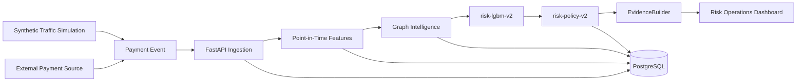

# Aegis

> Individual payments can look legitimate. Aegis detects the network behind them.

Aegis is a graph-assisted AI risk system that detects coordinated payment abuse across seemingly
unrelated accounts and explains the evidence behind every intervention. It is a working
end-to-end prototype for Razorpay AI Buildathon Track 2: **AI Risk Manager**.

## The problem

Card-testing rings, account farms, identity rotation, and collusive payment groups rarely reveal
their full structure in one transaction. Multiple customers can reuse devices, instruments, IPs,
and addresses while each payment remains individually plausible. Aegis combines point-in-time
behavior with relationship structure to expose that coordinated activity without leaking future
information into the decision.

## What Aegis does

- Accepts ordinary payment events through a validated FastAPI ingestion contract.
- Computes 52 strictly historical behavioral and velocity features (`features-v1`).
- Builds 25 point-in-time graph metrics and named structural signals (`graph-v1`).
- Ranks risk with the frozen 77-input LightGBM model (`risk-lgbm-v2`).
- Converts the uncalibrated score into bounded, human-review-aware recommendations
  (`risk-policy-v2`).
- Produces a truth-free EvidenceBundle and deterministic investigation after the decision.
- Presents operations, an evolving identity graph, investigations, a live synthetic traffic
  simulation, and frozen evaluation results in a Next.js dashboard.

## 60-second architecture



The simulation is only a traffic source. It uses the same ingestion and assessment services as an
external payment event and cannot provide a model score, graph signal, cluster, or policy action.

## Why graph intelligence

Aegis represents customers, payment instruments, devices, IP addresses, and addresses as typed
entities. Relationships are reconstructed only from transactions strictly earlier than the
payment being scored. This makes shared infrastructure and rapid identity expansion visible while
keeping graph evidence point-in-time and auditable.

## Live simulation

The **Synthetic Traffic Simulation** establishes 12 legitimate-looking baseline transactions and
then injects 18 Identity Rotation events through the live pipeline. Customers rotate across six
instruments while reusing device and network infrastructure. Click **Inject Abuse Ring** to watch
relationships emerge, the uncalibrated model score change, graph signals activate, and the real
policy respond.

The retained frozen scenario ends at `VERIFY` with an observed score of approximately `0.95252`.
That is intentional: the simulator generates traffic but cannot command the model or policy.
Simulation mutation routes remain hidden unless `AEGIS_DEMO_MODE=true`.

## Evaluation

Frozen `synthetic-v2` held-out test results (seed 88421, 7,500 test transactions):

| Model family | Inputs | PR-AUC | Precision | Recall | F1 | FP | FN |
|---|---:|---:|---:|---:|---:|---:|---:|
| Tabular LightGBM | 52 | 0.974894 | 0.849638 | 0.967010 | 0.904532 | 83 | 16 |
| Graph LightGBM | 25 | 0.996506 | 0.973896 | 1.000000 | 0.986775 | 13 | 0 |
| Combined `risk-lgbm-v2` | 77 | **0.998365** | **0.991525** | 0.964948 | 0.978056 | **4** | 17 |

Graph-only was extremely strong at its independently selected threshold; combined achieved the
best ranking PR-AUC and reduced false positives from **83 → 13 → 4** across the comparison. A fresh
post-freeze external synthetic seed (91573) was weaker: PR-AUC `0.985832`, precision `0.680086`,
recall `0.989429`, F1 `0.806099`, FP `1,629`, and FN `37`. Aegis retained that result without
retuning.

Policy-v2 also missed its 5% validation legitimate-intervention budget on the external world
(11.17%), although severe legitimate interventions remained 0%. These are designed synthetic
results, not production or Razorpay performance claims. Open **Evaluation Lab** at `/evaluation`
for artifact-backed methodology, operating-policy results, and limitations.

## AI judgment: where AI is and is not used

| Boundary | Implementation |
|---|---|
| Transaction and behavioral patterns | LightGBM risk ranking |
| Relationship structure | Deterministic temporal graph engine plus graph features |
| Business intervention | Versioned deterministic policy with human-review safeguards |
| Human-readable investigation | Evidence-first deterministic investigator; optional read-only provider boundary |

An LLM is never used for payment decisions, threshold selection, or policy execution. No API key
or network AI service is required. The model emits an **uncalibrated risk ranking score, not a
fraud probability**, and the policy makes recommendations rather than executing payment actions.

## Quick start — easiest evaluator path

Requirements: Docker with Compose.

```bash
cp .env.example .env
make up
```

`make up` explicitly enables the simulation for the local showcase, builds PostgreSQL, API, and
web services, waits for database readiness, and applies all Alembic migrations. Then open:

- Dashboard: <http://localhost:3000>
- Evaluation Lab: <http://localhost:3000/evaluation>
- Interactive API docs: <http://localhost:8000/docs>

In another terminal, verify the running stack with `make smoke`. Stop it with `make down`.
To use Compose directly, run `AEGIS_DEMO_MODE=true docker compose up --build`.

## Local development — without Docker

Requirements: Python 3.12+, PostgreSQL 16, and Node.js 20.19+ (Node 22 recommended).

Create an empty PostgreSQL database and set `AEGIS_DATABASE_URL` in `.env` to its asyncpg URL.
Then start the API:

```bash
cp .env.example .env
# Set AEGIS_DEMO_MODE=true in .env for the simulation controls.
python3.12 -m venv .venv
. .venv/bin/activate
pip install -e '.[dev]'
alembic upgrade head
uvicorn apps.api.app.main:app --reload
```

In a second terminal:

```bash
cd apps/web
cp .env.example .env.local
npm ci
npm run dev
```

Open <http://localhost:3000>. Run `make smoke` from the repository root while the API is running.

## Operational API workflow

The application works independently of the simulator. This example uses the actual ingestion
contract (use a unique `event_id` when repeating it):

```bash
curl -sS http://localhost:8000/api/v1/transactions \
  -H 'Content-Type: application/json' \
  -d '{
    "event_id":"evt_public_example_001",
    "event_time":"2026-08-31T10:00:00Z",
    "customer_ref":"cus_token_001",
    "account_created_at":"2025-08-31T10:00:00Z",
    "customer_segment":"RETAIL",
    "home_region":"IN-KA",
    "instrument_fingerprint":"card_token_001",
    "instrument_type":"CARD",
    "issuer_region":"IN-MH",
    "device_fingerprint":"device_token_001",
    "device_type":"MOBILE",
    "os_family":"ANDROID",
    "browser_family":"CHROME",
    "ip_hash":"ip_token_001",
    "network_type":"MOBILE",
    "ip_region":"IN-KA",
    "address_fingerprint":"address_token_001",
    "address_region":"IN-KA",
    "postal_prefix":"560",
    "merchant_ref":"merchant_token_001",
    "merchant_category":"ECOMMERCE",
    "merchant_region":"IN-KA",
    "merchant_risk_baseline":0.05,
    "amount_paise":149900,
    "payment_method":"CARD",
    "status":"AUTHORIZED"
  }'
```

Copy the returned `transaction_public_id`, then run the real assessment and investigation:

```bash
curl -sS -X POST http://localhost:8000/api/v1/transactions/txn_.../assess
curl -sS http://localhost:8000/api/v1/transactions/txn_.../investigation
curl -sS http://localhost:8000/api/v1/transactions/txn_.../graph
```

## Using Aegis

- **Operations dashboard:** truth-free counts, policy filters, assessed/pending queue, and explicit
  loading, empty, and disconnected states.
- **Synthetic Traffic Simulation:** sequential events, live score/action/signal count, graph
  evolution, and retry-safe steps.
- **Identity graph:** bounded point-in-time entity relationships and named structural signals.
- **Investigation:** policy-consistent summary, ranked evidence, strictly-prior timeline,
  recommended next step, and limitations.
- **Evaluation Lab:** frozen held-out model comparison, external generalization, operating-policy
  evaluation, methodology, provenance, and limitations.

## Reproducibility

The submission boundary is versioned and frozen: `synthetic-v2`, `features-v1`, `graph-v1`,
`risk-lgbm-v2`, and `risk-policy-v2`. Application startup does not generate 50,000 transactions,
train a model, rebuild graph benchmarks, or optimize policy. Required small model, schema, policy,
and evaluation artifacts are committed under `ml/artifacts/`; large generated datasets are ignored.

Quality commands:

```bash
make verify       # Ruff plus frontend lint, TypeScript, and production build
make test         # complete Python test suite; DB tests require AEGIS_TEST_DATABASE_URL
make smoke        # running-stack submission smoke
```

## Known limitations

- Training and evaluation use synthetic data only; no real Razorpay data is included.
- The score is uncalibrated, and production calibration, fairness, drift, governance, and capacity
  evaluation remain future work.
- Graph cluster discovery can fragment coordinated groups; clusters remain corroborative only.
- External policy intervention drift is retained rather than hidden or retuned away.
- Economics are illustrative synthetic assumptions, not claimed savings.
- Aegis never autonomously applies a permanent block.
- The deterministic investigator is the primary implementation; no live LLM dependency is bundled.

## Technology

- Frontend: Next.js, React, TypeScript, Tailwind CSS, `@xyflow/react`
- Backend: FastAPI, Pydantic, SQLAlchemy 2.x async, Alembic
- Data: PostgreSQL
- ML: LightGBM, NumPy, scikit-learn

## Repository structure

```text
apps/api/          FastAPI routes, persistence, services, and tests
apps/web/          Next.js operations dashboard and Evaluation Lab
packages/          Synthetic, features, graph, policy, and investigator boundaries
ml/artifacts/      Frozen schemas, model, policy, and evaluation artifacts
configs/           Versioned scenario, ML, cost, and policy configuration
alembic/           Ordered PostgreSQL migrations
scripts/           Reproducibility utilities and submission smoke
docs/              Architecture, evaluation, threat model, and submission material
```

## Documentation

- [Architecture](docs/ARCHITECTURE.md)
- [Model card](docs/MODEL_CARD.md) and [ML evaluation](docs/ML_EVALUATION.md)
- [Feature semantics](docs/FEATURES.md) and [graph intelligence](docs/GRAPH_INTELLIGENCE.md)
- [Policy engine](docs/POLICY_ENGINE.md) and [investigator](docs/INVESTIGATOR.md)
- [Threat model](docs/THREAT_MODEL.md) and [data generation](docs/DATA_GENERATION.md)
- [Submission narrative](docs/SUBMISSION.md), [demo script](docs/DEMO_SCRIPT.md), and
  [release checklist](docs/RELEASE_CHECKLIST.md)
